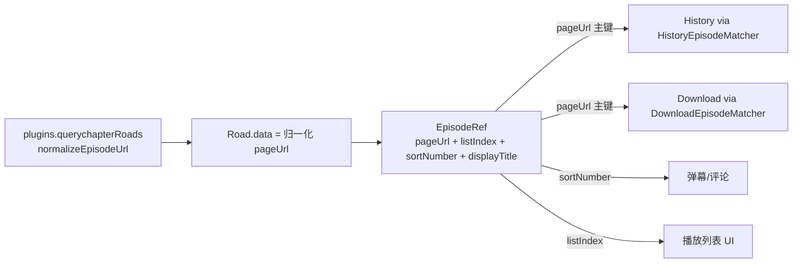

# 全链路统一集数身份模型（增量 / pageUrl 主键）

## 设计原则

把"集"的四个正交维度显式分离，永不再用一个 `int` 兼任多职：

- 位置维度 `listIndex`（1-based，仅 UI 排序）
- 来源维度 `pageUrl`（**稳定主键**，归一化后的源站 URL）
- 语义维度 `sortNumber`（真实集号，优先 Bangumi `EpisodeInfo.sort`，回退标题正则，可空）
- 展示维度 `displayTitle`

收敛策略：**历史复刻下载已有的 URL 优先匹配模式**。下载侧 `DownloadEpisodeMatcher`（`lib/repositories/download_repository.dart`）已经是 `pageUrl → episodeNumber → 唯一 episodeName` 三级匹配；历史侧目前还在用 `history.progresses[episode]`（在线即列表位置）。两者统一到同一个身份对象 + 同一套匹配器。

## 当前基线（已在分支上完成，作为前置）

- `split/playback-episode-identity`：已引入 `ResolvedEpisode`（`lib/pages/video/video_controller.dart`，拆出 `listIndex/historyEpisodeNumber/danmakuEpisodeNumber/episodePageUrl/originalRoadIndex`）、`PlaybackHistoryIdentity` + `HistoryEntryKind`（`lib/modules/history/history_module.dart`，在线/离线分桶 key）、`History.episodePageUrl`、`Progress.updatedAtMs`、`OfflineRoadListSnapshot`。
- 缺口：`Progress` 仍以 `int episode` 为 key（`HistoryRepository.findProgress/getLastWatchingProgress` 用 `history.progresses[episode]`），在线恢复仍按列表位置（`video_page.dart` `_initOnlineMode` 用 `progress.episode` 当下标）→ 源站重排即错位。这是本计划要补的根本点。

## 前置依赖

本计划构建在 `split/playback-episode-identity` 之上。需先确认该分支已合入 `main`（或新分支基于它），否则 PR1 起点需先 rebase 该基线。

## 分阶段（每阶段 = 一个可独立上游的小 PR）

### PR1 — URL 归一化（纯函数、低风险）
- 新增 `lib/utils/episode_url.dart`：`normalizeEpisodeUrl(baseUrl, raw)`，统一处理相对/绝对、http/https、尾斜杠，保证"同一集"始终产出同一 key 串。
- 接入两端：构建处 `Plugin.querychapterRoads`（`lib/plugins/plugins.dart`）写入 `Road.data` 前归一；消费处 `video_controller.dart` 现有的 `baseUrl` 临时拼接逻辑替换为该函数。
- 测试：`test/episode_url_test.dart`。

### PR2 — 统一身份对象 EpisodeRef
- 将 `ResolvedEpisode` 泛化/重命名为贯穿全链路的 `EpisodeRef`（仍含 `listIndex/roadIndex/displayTitle/pageUrl/sortNumber/originalRoadIndex`，online/offline 工厂保留）。
- 让 `EpisodeRef` 成为传给 `PlaybackInitParams`（`lib/pages/player/controller/player_models.dart`，已带 `danmakuEpisodeNumber`）、历史、SyncPlay 的唯一货币对象；消除调用点对 `selection.episode` 的语义臆测。
- 主要为重构，行为不变；补 `test/resolved_episode_test.dart` 的迁移断言。

### PR3 — 历史以 pageUrl 为主键（核心收敛）
- `lib/modules/history/history_module.dart`：`Progress` 新增 `@HiveField(4, defaultValue: '') String episodePageUrl`，重生成 `history_module.g.dart`。
- 新增 `HistoryEpisodeMatcher`（镜像 `DownloadEpisodeMatcher`）：`归一化 pageUrl → int episode → 写穿回填 episodePageUrl`。
- `lib/repositories/history_repository.dart`：`updateHistory/findProgress/getLastWatchingProgress/clearProgress` 改为经 `PlaybackHistoryIdentity.episodePageUrl` + 匹配器查找；写入时落 `episodePageUrl`。
- 恢复路径 `lib/pages/video/video_page.dart` `_initOnlineMode`：按 `pageUrl` 在当前 `roadList` 定位列表位置，替代 `progress.episode` 直接当下标 → 根治源站重排错位。
- 迁移/回填：首次加载时按 listIndex 从 `roadList` 回填旧 `Progress.episodePageUrl`；WebDAV 同步事件载荷（`lib/modules/history/history_sync.dart`、`history_sync_service.dart`）扩展携带 `episodePageUrl`，保持向后兼容默认空。
- 测试：扩展 `test/history_repository_test.dart`（URL 优先、int 回退、回填、重排稳定）。

### PR4 — 抽出通用 EpisodeMatcher（去重）
- 将 `DownloadEpisodeMatcher` 与 `HistoryEpisodeMatcher` 的三级匹配抽成泛型 `EpisodeMatcher`，下载与历史共用一套实现与归一化，保证两条链路语义一致。

### PR5 — sortNumber 锚定 Bangumi + 修 bug
- `EpisodeRef.sortNumber` 优先用 Bangumi `EpisodeInfo.sort`（已通过 episodes API 获取）映射 listIndex，回退 `extractEpisodeNumber`（`lib/utils/media.dart`），再回退 listIndex；弹幕/评论改用 `sortNumber`。
- 顺手修已知缺陷：自动连播 toast 的 `identifier[playingSelection.episode]` 缺 `-1`（`lib/pages/player/player_item.dart`）；统一 SyncPlay 文件 id `"$bangumiId[$currentEpisode]"` 的在线/离线语义。

## 暂不做（记录为后续）
- 将 `Road` 的 `data`/`identifier` 平行数组替换为 `List<EpisodeEntry>` 对象列表：最干净但改动面最大、迁移风险高，按增量原则推迟到上述链路稳定后单独立项。

## 数据流（目标态）

