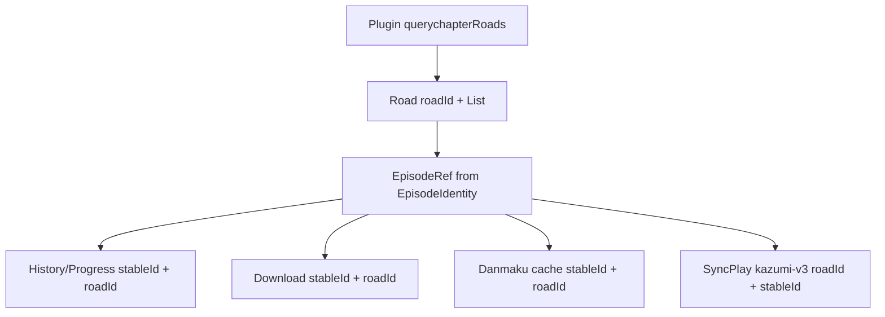

# Episode 身份设计

目标：不再让播放器从 URL 反推 episode 身份，而是让订阅规则（`Plugin`）在抓取阶段产出稳定 episode 身份。下游（历史、弹幕、选集、下载、SyncPlay）直接消费规则产物，不再做“标题正则 + 数组下标 + URL 字符串反查”的事后重建。

## 核心规则

1. `stableId` 是单集身份。它在同一 `(pluginName, bangumiId, roadId)` 作用域内唯一，必须和域名、协议、列表顺序无关。
2. `roadId` 是线路身份。它用于消除 `roadList` 数组下标重排带来的歧义。
3. `pageUrl` 只用于发起请求和展示调试信息，不参与身份匹配。
4. `ordinal` 只用于排序、弹幕集号和显示语义，不参与持久身份匹配。
5. 新写入的历史、下载、弹幕缓存和 SyncPlay 身份都必须带 `stableId`；有线路歧义时必须同时带 `roadId`。



## 数据结构

`Road.data` 保存结构化的 `EpisodeIdentity`：

```dart
class EpisodeIdentity {
  final String stableId;
  final String pageUrl;
  final String title;
  final int? ordinal;
  final int roadIndex;
  final String roadId;
}

class Road {
  String name;
  String roadId;
  List<EpisodeIdentity> data;
}
```

`Plugin` 新增/使用的字段：

| 字段 | 用途 | 缺省行为 |
| --- | --- | --- |
| `episodeId` | 抽取源站稳定单集标识 | 空时用归一化后的相对 path 作为 `stableId` |
| `episodeTitle` | 抽取展示标题 | 空时使用 `第N集` 占位 |
| `episodeOrder` | 抽取对齐 Bangumi 的集序号 | 空时保留标题解析作为排序/弹幕降级，不写回身份 |
| `roadId` | 抽取源站稳定线路标识 | 空时保持为空，表示没有稳定线路身份 |

`Plugin.querychapterRoads` 是唯一允许从 HTML/XPath/URL fallback 构造身份的边界。若 `episodeId` 与 URL fallback 都无法产出非空 `stableId`，该 episode 不进入 `Road.data`。

## 下游边界

历史：

- `PlaybackHistoryIdentity.canRecord` 要求 `stableId` 非空。
- `History` 和 `Progress` 持久化 `stableId` 与 `roadId`。
- `History.progresses` 使用稳定字符串 key：优先 `roadId + stableId`；缺少 `roadId` 时才使用受控 `road + stableId` 作用域，且不把 `road` 下标解释为稳定线路身份。集号只保留在 `Progress.episode` 作为展示/排序信息。
- `findProgress` / `clearProgress` / `getLastWatchingProgress` 只按 `stableId + roadId`、或没有 `roadId` 时按 `stableId + road`、或无线路信息时唯一 `stableId` 命中。
- 不再用 `episodePageUrl` 或 episode 数组下标回填身份。

下载：

- `DownloadEpisode` 持久化 `stableId` 与 `roadId`。
- 下载入口接收完整 `EpisodeIdentity`，由控制器内部派生请求 URL、展示标题、ordinal 与 road identity。
- 下载 key 优先由 `(bangumiId, roadId, stableId)` 生成。
- 重复下载检测、离线恢复、下载状态图标都按 `stableId + roadId` 匹配。
- 没有 `stableId` 的下载请求直接拒绝；离线恢复也不会按数值集号兜底。

播放器与选集：

- 在线播放从 `EpisodeIdentity` 构造 `EpisodeRef`，不从 URL/标题反推。
- 历史恢复和 SyncPlay 切集使用 `stableId + roadId`。
- `ordinal` 只用于展示、排序和弹幕集号；缺少 `stableId` 时不恢复选集。

弹幕与 SyncPlay：

- 弹幕缓存读写传递 `stableId + roadId`，防止多线路共享集号时串档。
- SyncPlay 文件名使用 `kazumi-v3:<bangumiId>:<roadId>:<stableId>`；旧格式仅允许解析，不再作为新身份来源。

## 不做的事

- 不再维护旧历史的 URL 迁移或 pageUrl 回填。
- 不再从 URL 字符串反查当前 episode。
- 不再把 `roadList` 数组下标当作稳定线路身份。
- 不再把标题正则解析结果当作持久 episode 身份。

## 关键源码

- 规则与抓取：`lib/plugins/plugins.dart`
- 线路模型：`lib/modules/roads/road_module.dart`
- 在线/离线播放选择：`lib/pages/video/video_controller.dart`
- 历史身份与匹配：`lib/modules/history/history_module.dart`、`lib/repositories/history_repository.dart`
- 同步历史：`lib/modules/history/history_sync.dart`、`lib/services/sync/history_sync_service.dart`
- 下载身份：`lib/modules/download/download_module.dart`、`lib/pages/download/download_controller.dart`
- SyncPlay 身份：`lib/pages/player/controller/player_models.dart`
