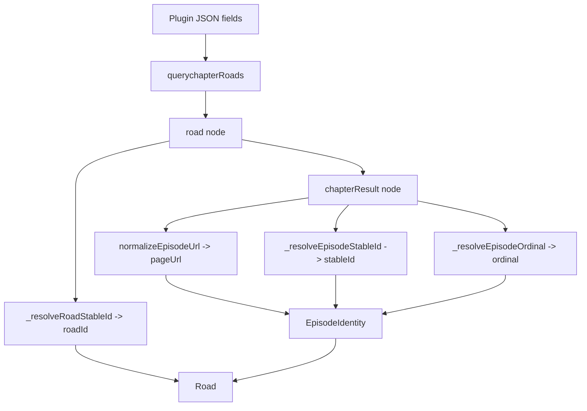

# stableId / roadId 解析与消费

本文描述当前实现中 episode 身份如何从订阅规则产生，并在播放、历史、下载、弹幕缓存和 SyncPlay 中消费。对应代码主要在 `lib/plugins/plugins.dart`、`lib/modules/roads/road_module.dart`、`lib/pages/video/video_controller.dart`、`lib/repositories/history_repository.dart`、`lib/modules/history/history_sync.dart`、`lib/modules/download/download_module.dart`。

## 1. 定义

`stableId` 是单集稳定定位 key，回答“这是不是同一集”。它不承担请求 URL、展示标题、弹幕集号或排序职责。

`roadId` 是稳定线路 key，回答“这是哪个播放线路”。当不同线路共享同一个 `stableId`，下游必须用 `stableId + roadId` 消歧。

```dart
class EpisodeIdentity {
  final String stableId; // 单集身份
  final String pageUrl;  // 可访问 URL，不参与身份匹配
  final String title;    // 展示标题
  final int? ordinal;    // 排序 / 弹幕集号
  final int roadIndex;   // 当前抓取结果中的线路下标
  final String roadId;   // 稳定线路身份
}

class Road {
  String name;
  String roadId;
  List<EpisodeIdentity> data;
}
```

## 2. Plugin 输入字段

| 字段 | XPath 作用域 | 用途 | 空值策略 |
| --- | --- | --- | --- |
| `episodeId` | 每个 `chapterResult` 节点 | 抽取源站稳定单集 id/slug | 用归一化相对 URL 派生 `stableId` |
| `episodeTitle` | 每个 `chapterResult` 节点 | 抽取展示标题 | 使用节点文本或 `第N集` |
| `episodeOrder` | 每个 `chapterResult` 节点 | 抽取排序/弹幕序号 | 标题解析；失败则为 `null` |
| `roadId` | 每个 `chapterRoads` 节点 | 抽取源站稳定线路 id | 使用该线路 episode `stableId` 集合 hash；仍失败则 `road-index:N` |

`chapterRoads` 先选出线路节点，`chapterResult` 再在线路节点内选出单集节点。`episodeId`、`episodeTitle`、`episodeOrder` 都相对单集节点解析；`roadId` 相对线路节点解析。

## 3. 构建流程



`stableId` 构建优先级：

1. `episodeId` XPath 抽取到的非空值。
2. `stableEpisodeIdFromUrl(baseUrl, normalizedUrl)` 派生的相对 URL 身份。

`stableEpisodeIdFromUrl` 会先归一化 URL，再剥离 `scheme://host[:port]`，保留 `path + ?query + #fragment`。如果源站 query 中含 session token、时间戳等易变值，规则必须配置显式 `episodeId`。

如果上述两步仍无法得到非空 `stableId`，`Plugin.querychapterRoads` 会跳过该 episode；播放器、历史和下载层不会再补身份。

`roadId` 构建优先级：

1. `roadId` XPath 抽取到的非空值。
2. 当前线路内所有非空 episode `stableId` 排序后计算 hash。
3. `road-index:N`。

## 4. 下游消费

选集与播放：

- `EpisodeRef` 直接从 `EpisodeIdentity` 构造。
- 历史恢复通过 `findEpisodeSelectionByStableId(stableId, preferredRoadId)`。
- 非空 `stableId` 未命中时，不按数组下标兜底。

历史：

- `PlaybackHistoryIdentity.canRecord` 要求非空 `stableId`。
- `History`、`Progress` 都持久化 `stableId` 和 `roadId`。
- `History.progresses` 是 `Map<String, Progress>`；key 由 `historyProgressKey(stableId, roadId, road)` 生成，不再使用集号作为持久 bucket。
- 匹配优先级为 `stableId + roadId`，然后是无 `roadId` 调用下的 `stableId + road`，最后才是无线路信息时唯一 `stableId` 命中。
- 不再用 `episodePageUrl` 或集号回填身份。

下载：

- `DownloadEpisode` 持久化 `stableId` 和 `roadId`。
- 下载入口接收完整 `EpisodeIdentity`，不再由调用方散传下载身份字段。
- `startDownload` 要求新下载有非空 `stableId`。
- 下载 key 优先由 `bangumiId + roadId + stableId` 派生。
- 下载状态、重复检测、离线恢复都按 `stableId + roadId` 匹配。
- `DownloadEpisode.ordinal` 只用于排序、展示和弹幕集号；缺少 `stableId` 时不按 ordinal 或列表位置恢复。

弹幕：

- 缓存读写传递 `stableId + roadId`，避免不同线路共享集号时串档。

SyncPlay：

- 新格式为 `kazumi-v3:<bangumiId>:<encoded roadId>:<encoded stableId>`。
- `v2` 和旧数值格式只保留解析兼容。

## 5. 明确不做

- 不维护旧历史 URL 迁移。
- 不从 `episodePageUrl` 反查当前 episode。
- 不把标题正则结果写回持久身份。
- 不把 `roadList` 数组下标当作稳定线路身份。

## 6. 测试覆盖

- `test/episode_ref_test.dart`：选集恢复、下载身份、离线路径、SyncPlay 身份。
- `test/history_repository_test.dart`：历史记录按 `stableId + roadId` 匹配，并拒绝 URL/下标兜底。
- `test/history_sync_test.dart`：同步合并按 `stableId + roadId` 分桶。
- `test/episode_url_test.dart`：URL 归一化与 URL fallback 身份派生。
